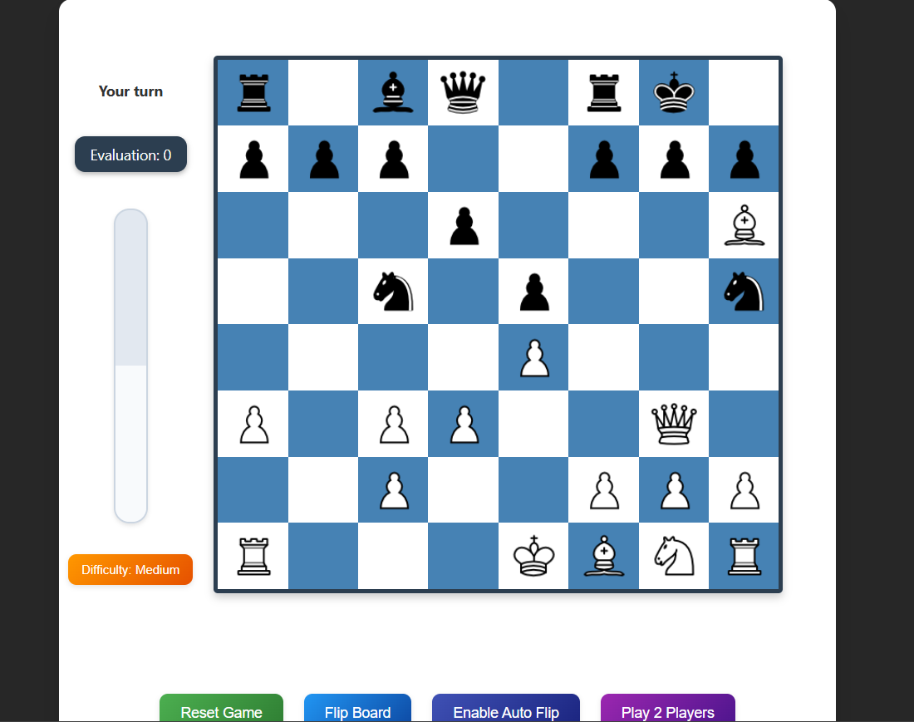

# 🎮 ReactMate Chess

<div align="center">


A modern, feature-rich chess application with multiple play modes and adaptive AI.

[View Demo](https://react-mate.vercel.app/) | [Report Bug](https://github.com/shashwath1278/ReactMate/issues) | [Request Feature](https://github.com/shashwath1278/ReactMate/issues)



</div>

## ✨ Features

- **Multiple Game Modes**
  - 👥 Play against a friend locally
  - 🤖 Challenge the AI with three difficulty levels
  - 🔄 Auto-flip board option to follow the active player

- **Advanced Chess AI**
  - 🧠 Custom-built AI engine for beginners (Easy mode)
  - ⚡ Combined custom/Stockfish hybrid for intermediate players (Medium mode)
  - 🏆 Full Stockfish engine integration for advanced players (Hard mode)
  - 📚 Opening book knowledge for realistic gameplay

- **Enhanced User Experience**
  - 🔍 Legal move highlighting when pieces are selected
  - 👑 Automated pawn promotion interface
  - ⚠️ Check and checkmate notifications
  - 📊 Real-time evaluation bar (when playing against AI)
  - 🔄 Game history tracking
  - 🎮 Intuitive drag and drop interface

- **Responsive Design**
  - 💻 Optimized for desktop
  - 📱 Touch-friendly for mobile devices
  - 🌓 Elegant visual design

## 🚀 Getting Started

### Prerequisites

- Node.js (v14.0.0 or later)
- npm or yarn

### Installation

1. Clone the repository
   ```bash
   git clone https://github.com/shashwath1278/ReactMate.git
   cd ReactMate
   ```

2. Install dependencies
   ```bash
   npm install
   # or
   yarn install
   ```

3. Start the development server
   ```bash
   npm start
   # or
   yarn start
   ```

4. Open your browser and navigate to [http://localhost:3000](http://localhost:3000)

## 🎮 How to Play

### Game Modes

- **Two-Player Mode**: Play against a friend on the same device with turn-based gameplay.
- **AI Mode**: Challenge the computer with adjustable difficulty levels.

### AI Difficulty Levels

- **Easy**: Perfect for beginners, makes intentional mistakes but avoids obvious blunders.
- **Medium**: Plays a more strategic game, combines custom AI logic with Stockfish calculations.
- **Hard**: Utilizes the full power of the Stockfish chess engine for advanced players.

### Controls

- **Select and Move**: Click or tap a piece, then click or tap a highlighted square to move.
- **Drag and Drop**: Click and drag a piece to a valid square.
- **Promotion**: When a pawn reaches the opposite end of the board, a promotion menu appears.
- **Game Controls**: Reset game, toggle board flip, switch game modes, and adjust difficulty through the control panel.

## 🏗️ Technical Architecture

ReactMate Chess is built with a modern front-end stack:

- **React**: Component-based UI architecture
- **RxJS**: Reactive state management
- **Chess.js**: Chess rules and validation
- **Stockfish.js**: WebAssembly-powered chess engine
- **React DnD**: Drag and drop interface

The AI system uses a hybrid approach:
- Custom-built evaluation functions for piece valuation and position
- Opening book knowledge for early game moves
- Adaptive difficulty with variable search depth
- Stockfish integration for advanced analysis

## 🤝 Contributing

Contributions are what make the open source community such an amazing place to learn, inspire, and create. Any contributions you make are **greatly appreciated**.

1. Fork the Project
2. Create your Feature Branch (`git checkout -b feature/AmazingFeature`)
3. Commit your Changes (`git commit -m 'Add some AmazingFeature'`)
4. Push to the Branch (`git push origin feature/AmazingFeature`)
5. Open a Pull Request

## 📜 License

Distributed under the MIT License. See `LICENSE` for more information.

## 🙏 Acknowledgments

- [Chess.js](https://github.com/jhlywa/chess.js) for chess move validation
- [Stockfish](https://stockfishchess.org/) for the powerful chess engine
- [React DnD](https://react-dnd.github.io/react-dnd/) for drag and drop functionality
- [RxJS](https://rxjs.dev/) for reactive programming

---

<div align="center">
  Built with ❤️ by Shashwath
</div>

